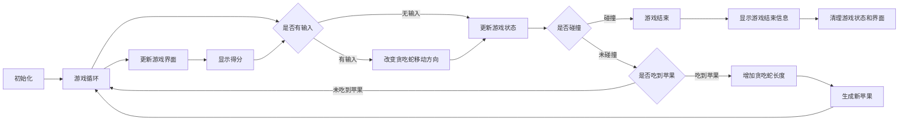

# snake-asm

## 参考资料
[Searchable Linux Syscall Table for x86 and x86_64 | PyTux](https://filippo.io/linux-syscall-table/)

[Linux System Call Table for x86 64](https://blog.rchapman.org/posts/Linux_System_Call_Table_for_x86_64/)

## 运行
背景音乐的播放依赖于`sox`及其解码器，所以在运行游戏前需要先安装`sox`及其解码器：
```bash
sudo apt install sox libsox-fmt-all
```

## 总体描述
### 程序流程
以下是游戏逻辑的大致流程：

1. 初始化：
   1. 设置游戏界面的大小和初始状态。
   2. 创建贪吃蛇的初始位置和长度
   3. 放置初始数量的苹果。
   4. 创建子进程，用于播放背景音乐。
2. 游戏循环：
   1. 不断监听玩家输入，根据输入来改变贪吃蛇的移动方向。
   2. 每隔一定时间间隔，更新游戏状态。
   3. 判断贪吃蛇是否与边界、自身或苹果发生碰撞，根据情况更新游戏状态。
   4. 如果贪吃蛇吃到了苹果，增加贪吃蛇的长度并生成新的苹果。
   5. 更新游戏界面并显示当前的得分。
3. 游戏结束：
   1. 当贪吃蛇与边界、自身碰撞，或者玩家选择退出游戏时，游戏结束。
   2. 显示游戏结束信息。
   3. 清理游戏状态和界面。关闭用于播放背景音乐的子进程。
游戏程序流程图如下：

### 总体架构
本程序采用分模块的方式来实现，主要分为以下几个模块：
1. `snake` 贪吃蛇模块，也是游戏的核心模块，游戏的主循环在这个模块中实现
   + `snake.asm`
2. `syscall` 系统调用模块，封装了若干`Linux`系统调用，用于实现游戏的一些功能
   + `syscall.asm`
   + `syscall.mac`
   + `syscall.inc`
3. `print` 打印模块，完成对`write`系统调用的二次封装，并实现了方便的打印字符串和数字的函数
   + `print.asm`
   + `print.mac`
   + `print.inc`
4. `term` 终端模块，封装了`Linux`的终端相关的系统调用与相关结构体的定义
   + `term.asm`
5. `utils` 工具模块，实现了程序中用到的一些工具函数：随机数生成和内存复制
   + `utils.asm`

除了`snake`模块作为游戏的主体流程外，其他模块都是为`snake`模块服务的，都间接或直接地被`snake`模块调用。其中`.asm`文件是函数的具体实现，`.mac`文件是该模块函数对外的接口（利用`extern`声明），而`.inc`文件是该模块提供的一些宏定义和结构体的定义。

## 模块介绍
### snake 
### syscall
### print
### term
### utils

