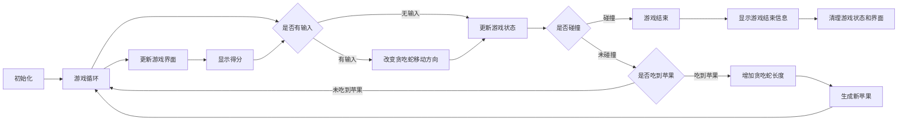
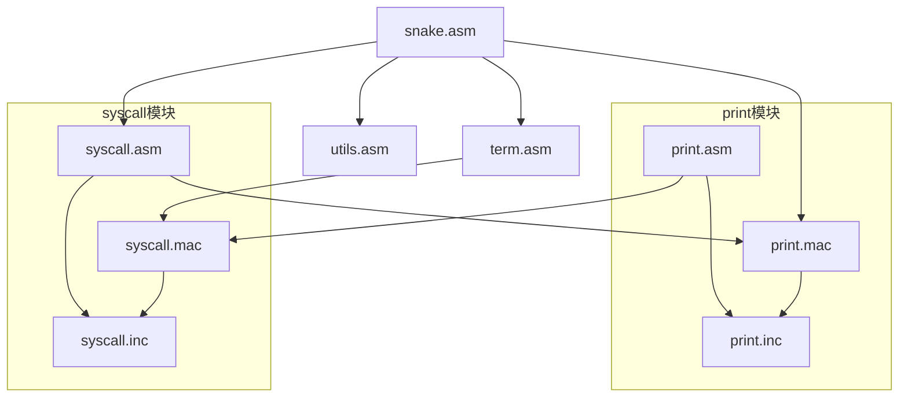

# snake-asm

## 参考资料
[Searchable Linux Syscall Table for x86 and x86_64 | PyTux](https://filippo.io/linux-syscall-table/)

[Linux System Call Table for x86 64](https://blog.rchapman.org/posts/Linux_System_Call_Table_for_x86_64/)

## 运行
背景音乐的播放依赖于`sox`及其解码器，所以在运行游戏前需要先安装`sox`及其解码器：
```bash
sudo apt install sox libsox-fmt-all
```

## 总体描述
### 程序流程
以下是游戏逻辑的大致流程：

1. 初始化：
   1. 设置游戏界面的大小和初始状态。
   2. 创建贪吃蛇的初始位置和长度
   3. 放置初始数量的苹果。
   4. 创建子进程，用于播放背景音乐。
2. 游戏循环：
   1. 不断监听玩家输入，根据输入来改变贪吃蛇的移动方向。
   2. 每隔一定时间间隔，更新游戏状态。
   3. 判断贪吃蛇是否与边界、自身或苹果发生碰撞，根据情况更新游戏状态。
   4. 如果贪吃蛇吃到了苹果，增加贪吃蛇的长度并生成新的苹果。
   5. 更新游戏界面并显示当前的得分。
3. 游戏结束：
   1. 当贪吃蛇与边界、自身碰撞，或者玩家选择退出游戏时，游戏结束。
   2. 显示游戏结束信息。
   3. 清理游戏状态和界面。关闭用于播放背景音乐的子进程。
   游戏程序流程图如下：

### 总体架构
本程序采用分模块的方式来实现，主要分为以下几个模块：
1. `snake` 贪吃蛇模块，也是游戏的核心模块，游戏的主循环在这个模块中实现
   + `snake.asm`
2. `syscall` 系统调用模块，封装了若干`Linux`系统调用，用于实现游戏的一些功能
   + `syscall.asm`
   + `syscall.mac`
   + `syscall.inc`
3. `print` 打印模块，完成对`write`系统调用的二次封装，并实现了方便的打印字符串和数字的函数
   + `print.asm`
   + `print.mac`
   + `print.inc`
4. `term` 终端模块，封装了`Linux`的终端相关的系统调用与相关结构体的定义
   + `term.asm`
5. `utils` 工具模块，实现了程序中用到的一些工具函数：随机数生成和内存复制
   + `utils.asm`

除了`snake`模块作为游戏的主体流程外，其他模块都是为`snake`模块服务的，都间接或直接地被`snake`模块调用。
为了降低耦合性和内聚性，两个大的模块`print`和`syscall`都进行了解耦操作：其中`.asm`文件是函数的具体实现，`.mac`文件是该模块函数对外的接口（利用`extern`声明），而`.inc`文件是该模块提供的一些宏定义和结构体的定义。
其依赖图如下：


## 模块介绍
### snake 

#### 宏介绍
首先是定义了基本参数，比如游戏界面的大小以及贪吃蛇的初始长度，最重要的是定义了帧与帧之间的时间间隔，这个时间间隔决定了游戏的速度。
然后定义了蛇移动方向（上下左右）、地图单元格类型（自由，墙壁、头部、身体、苹果）、游戏状态（运行、退出、死亡、狂欢）、按键宏（WASDQ ESC）、地图单元格样式以及长度。同时定义了关于ANSI控制码的宏`DEF_ESC_SEQ`和`DEF_COLOR_SEQ`，用于实现一些特殊的控制效果，比如清屏、光标移动、颜色设置等等。

#### 变量介绍
首先用宏定义了若干ANSI转义序列和颜色序列，以及定义了若干字符串常量，用于在游戏中显示一些信息。关于蛇的部分定义了长度，分数，蛇头位置XY、当前方向和移动方向。游戏方面定义了输入，当前帧数，游戏状态。音乐方面则定义了音乐播放器play及其相关参数。
在 bss 段则定义了若干缓冲区，用于存储地图空闲单元格，蛇身单元格以及打印缓冲区。


#### 函数介绍


### syscall
#### 宏介绍
首先定义了程序中所有用到的系统调用的宏标号，比如`SYS_WRITE`代表`write`系统调用，`SYS_EXIT`代表`exit`系统调用等等。
然后定义了一个宏`SYS`，封装原本使用的`syscall`指令。
同时在`syscall.inc`中定义了文件描述符的宏标号，比如`STDOUT`代表标准输出，`STDIN`代表标准输入等。
#### 变量介绍

结构体方面：定义了要在 term 模块中使用的终端结构体`termios`以及 sleep 函数中使用的`timespec`结构体。


#### 函数介绍
syscall中的所有函数都是对系统调用的二次封装，用于实现游戏的一些功能。值得注意的是在x64系统中，系统调用的参数传递是通过寄存器来实现的，具体的寄存器和参数的对应关系如下：
| 参数 | 寄存器 |
| ---- | ---- |
| rdi | 第一个参数 |
| rsi | 第二个参数 |
| rdx | 第三个参数 |
| r10 | 第四个参数 |
| r8 | 第五个参数 |
| r9 | 第六个参数 |
##### sleep
该函数用于使程序休眠一定的时间。它接受两个参数，分别是秒数和纳秒数，通过调用系统调用函数nanosleep来实现休眠功能。

##### ioctl

该函数用于获取或设置终端属性。它接受两个参数，第一个参数是termios结构体指针，第二个参数用于判断是获取还是设置终端属性。通过调用系统调用函数ioctl来实现终端属性的获取或设置。

##### exit

该函数用于退出程序并返回退出码。它接受一个参数，即退出码，通过调用系统调用函数exit来实现程序的退出。

##### poll

该函数用于轮询事件。它接受一个参数，即存放轮询结果的缓冲区指针。通过调用系统调用函数poll来进行事件的轮询。

##### write

该函数用于向指定文件描述符写入字符串。它接受三个参数，分别是字符串指针、字符串长度和文件描述符。通过调用系统调用函数write来实现字符串的写入。

##### read

该函数用于从标准输入读取数据。它接受两个参数，分别是缓冲区指针和读取的字节数。通过调用系统调用函数read来实现数据的读取。

##### exec

该函数用于执行命令。它接受两个参数，第一个参数是可执行文件路径字符串指针，第二个参数是以0结尾的指针数组，用于传递命令参数。通过调用系统调用函数execve来实现命令的执行。

##### fork

该函数用于创建子进程。它通过调用系统调用函数fork来创建子进程，并根据fork的返回值判断当前是在父进程还是子进程中。

##### kill

该函数用于终止进程。它接受两个参数，分别是要终止的进程ID和信号值。通过调用系统调用函数kill来实现进程的终止。


### print

#### 宏介绍

这里定义了三个宏用于简化汇编代码的编写。

- `DEF_STR_DATA`: 定义字符串数据并计算字符串长度。
- `PRINT_STR_DATA`: 打印字符串数据。
- `PRINT_NEW_LINE`: 打印换行符。

#### 变量介绍

在 data 段中定义了一个名为 "newline" 的字符串常量，其值为 ASCII 码为 10 的换行符。这里使用了之前定义的 `DEF_STR_DATA` 宏来定义字符串并计算字符串长度。

在 bss 段中定义了一个名为 `print_num_buf` 的 8 字节缓冲区，用于存储打印数字时的结果。

#### 函数介绍

##### `print`

函数 `print` 接受两个参数：`rax` 表示字符串的指针，`rdx` 表示字符串的长度。该函数调用 `write` 系统调用来将字符串打印到标准输出。函数执行完后，使用 `ret` 指令返回。

##### `print_num`

函数 `print_num` 接受一个参数：`rax` 表示要打印的数字。该函数将数字转换为字符串，并调用 `print` 函数将结果打印到标准输出。

函数首先将除数 10 存储在 `rbx` 寄存器中，并将数字位数的计数器 `rcx` 初始化为 0。然后使用 `idiv` 指令将 `rax` 寄存器中的数字除以 10，商存储在 `rax` 中，余数存储在 `rdx` 中。将余数加上字符 `'0'` 的 ASCII 码就得到了对应的数字字符，将其存储到缓冲区中。然后将位数计数器 `rcx` 加 1，检查商是否为 0，如果不为 0 则继续循环，直到商为 0。

最后，使用 `print` 函数打印数字的字符串表示。函数执行完后，使用 `ret` 指令返回。


### term

#### 宏介绍

定义了两个常量 `ICANON` 和 `ECHO`，分别表示规范模式和回显模式的标志位。

#### 变量介绍

在 bss 段中定义了两个 `termios` 结构体变量 `stty` 和 `tty`，用于存储旧的和新的终端属性。

#### 函数介绍

定义了两个全局函数 `set_noncanon` 和 `set_canon`，分别用于将终端切换到非规范模式和规范模式。

#####  `set_noncanon`

函数 `set_noncanon` 用于将终端从规范模式切换到非规范模式。该函数通过系统调用 `ioctl` 和参数 `TIOCGETA` 获取当前终端的属性，并将结果存储在 `stty` 中。然后再次调用 `ioctl` 和参数 `TIOCGETA` 获取终端的属性，并将结果存储在 `tty` 中。

接下来，该函数通过逻辑与运算符 `and` 将 `tty` 中的 `ICANON` 和 `ECHO` 标志位清除。最后再次调用 `ioctl` 并使用参数 `TIOCSETA` 将新的终端属性写入内核，从而完成终端从规范模式到非规范模式的切换。

#####  `set_canon`

函数 `set_canon` 用于将终端从非规范模式切换到规范模式。该函数从旧的 `termios` 结构体中恢复终端属性，然后再次调用 `ioctl` 将其写入内核，从而完成终端从非规范模式到规范模式的切换。

### utils

#### 函数介绍

##### memcpy

函数 `memcpy` 使用了 64 位寄存器 `rax`、`rdx` 和 `rcx`，分别表示目标地址、源地址和复制字节数。函数体使用 `mov` 指令将源地址和目标地址存入寄存器 `rsi` 和 `rdi` 中，使用 `cld` 指令清除方向标志位，确保复制操作从低地址向高地址进行，然后使用 `rep movsb` 指令进行内存复制，最后使用 `ret` 指令返回。

##### rand

函数 `rand` 使用了 64 位寄存器 `rax`、`rcx` 和 `rdx`，分别表示最大值、中间变量和余数。函数体使用 `mov` 指令将最大值存入寄存器 `rcx` 中，然后使用 `rdrand` 指令将随机数放入寄存器 `rax` 中。接下来使用 `div` 指令以 `rcx` 作为除数将 `rdx:rax` 除以 `rcx`，商存入 `rax` 中，余数存入 `rdx` 中。最后使用 `ret` 指令返回生成的随机数。

